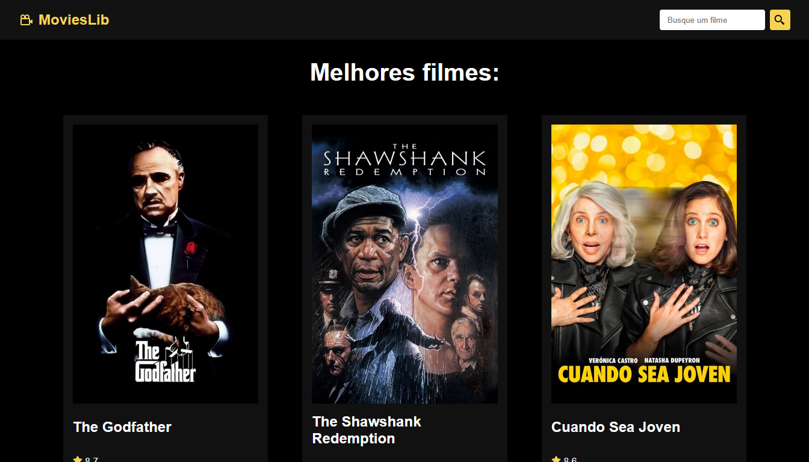

<h1 align="center"> 
    React-Movies
</h1>

  <a href="#-About">About</a>&nbsp;&nbsp;&nbsp;|&nbsp;&nbsp;&nbsp;
  <a href="#-Project">Project</a>&nbsp;&nbsp;&nbsp;|&nbsp;&nbsp;&nbsp;
  <a href="#-Technology">Technology</a>

    

<h5 style="text-align: center"> Thank you for see ! </h5>

## 📚 About

Olá a todos os desenvolvedores/programadores. Hoje venho apresentando meu primeiro repositório apresentando meu primeiro projeto em react chamado **_MoviesLib_**. Com ele temos a gestão de buscar e encontrar filmes e páginas individuais com detalhes sobre filmes. Com o react podemos trabalhar com um mesmo componentes em diversos arquivos reaproveitando o mesmo código. Algumas habilidades adquiridas nesse projeto foram: Trabalhar com rotas **React Router** e **React Hooks (useState e useEffect)**.

Para ter acesso a conteúdo similares, acesse [MatheusBatisti](https://www.youtube.com/@MatheusBattisti)

## 🚀 Technology

O projeto foi desenvolvido a partir das tecnologias:

- *HTML5*
- *CSS3*
- *REACT*

## 📚 About

Hi all developers/programmers. Today I've been presenting my first repository presenting my first react project called **_MoviesLib_**. With it we have the management of searching and finding movies and individual pages with details about movies. With react we can work with the same components in several files reusing the same code. Some skills acquired in this project were: Working with **React Router** routes and **React Hooks (useState and useEffect)**.

*To access similar content, go to [MatheusBatisti](https://www.youtube.com/@MatheusBattisti)*

## 🚀 Technologies Used:

*The project was developed based on technologies:*

- *HTML5*
- *CSS3*
- *REACT*

--------------

Developed by :atom_symbol: [**Arthur Silva**]([arthursj (ArthurSilva) (github.com)](https://github.com/arthursj))